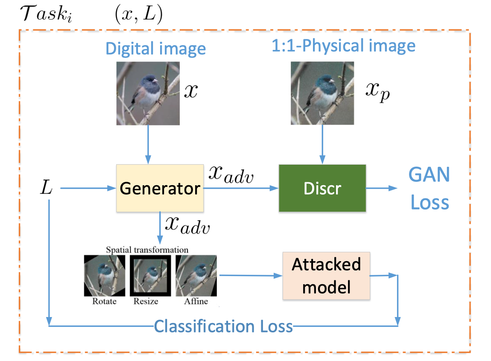

# advGAN
1. meta learning + real world attack + print-scan/color translation

2. Organize these translation datasets as:

       meta_datarooot
       ├── Tench2Snake
       |   ├── trainA
       |   ├── trainB
       |   
       ├── Cat2pSnake
           ├── trainA
           ├── trainB
       ...
